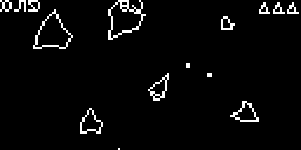

# Asteroids for Adafruit RP2040 + OLED display

Classic Asteroids clone on a 128×64 OLED display, running on an Adafruit Feather RP2040.

## Screenshot (mockup)

_(Real screenshot + video TODO)_

## Hardware

| Part | Detail |
|------|--------|
| Board | [Adafruit Feather RP2040](https://www.adafruit.com/product/4884) |
| Display | [128×64 OLED FeatherWing](https://www.adafruit.com/product/4650) (SH1107 controller) |
| Input | Wing buttons A, B, C; board BOOT button for fire (future iteration: move these to separate physical buttons) |

## Software

- **IDE:** Arduino IDE
- **Board package:** Raspberry Pi Pico/RP2040 by **Earle Philhower**
- **Board:** Adafruit Feather RP2040
- **Libraries:** Adafruit SH110x, Adafruit GFX, Adafruit BusIO, Adafruit NeoPixel

Install libraries via **Sketch > Include Library > Manage Libraries**.

## Upload

1. Connect the Feather with a data USB cable.
2. Select **Adafruit Feather RP2040** and the `/dev/cu.usbmodem*` port.
3. Open `rp2040_asteroids.ino` and click **Upload**.

## Controls

| Button | Screen | Action |
|--------|--------|--------|
| **A** | Title | Start game |
| **A** | Options | Move cursor up |
| **A** | Play | Rotate left |
| **C** | Title | Start game |
| **C** | Options | Move cursor down |
| **C** | Play | Rotate right |
| **B** | Title | Open options |
| **B** | Options | Change selected option |
| **B** | Play | Thrust |
| **BOOT** | Title | Start game |
| **BOOT** | Options | Back to title |
| **BOOT** | Play | Fire |

## Options

From the title screen, press **B** for options:

| Option | Values | Default |
|--------|--------|---------|
| **Diff** | LOW / MED / HIGH rock speed | MED |
| **God** | ON / OFF (invincible) | OFF |
| **Spread** | ON / OFF (3-way shmup shot) | OFF |

HIGH matches the original rock pace; MED and LOW are slower so dodging is realistic on 128×64. Spread fires a fan of three bullets each shot.

## Gameplay notes

- With god mode off, rocks collide with the ship.
- The onboard NeoPixel shows game status: rainbow on the title/options screens, green in play, blue-white while thrusting, red blink on game over.
